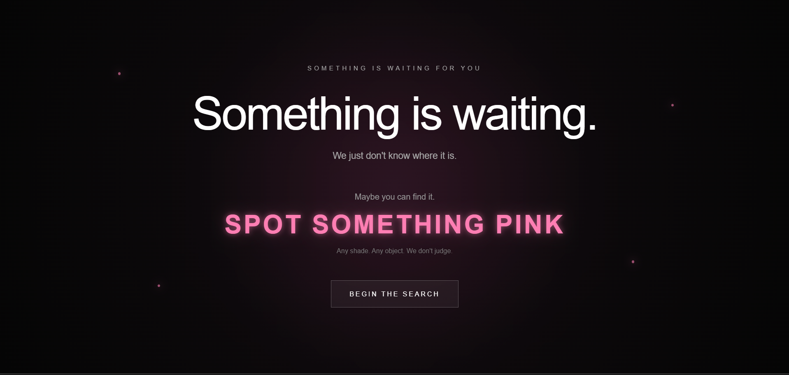
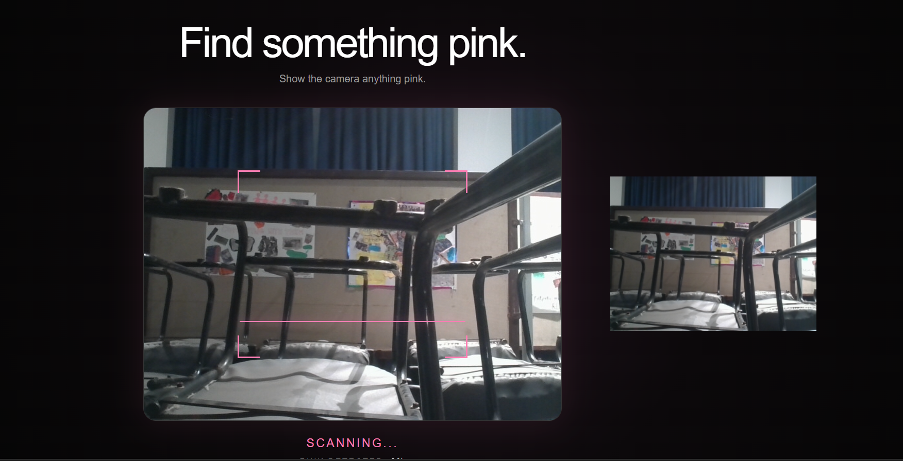
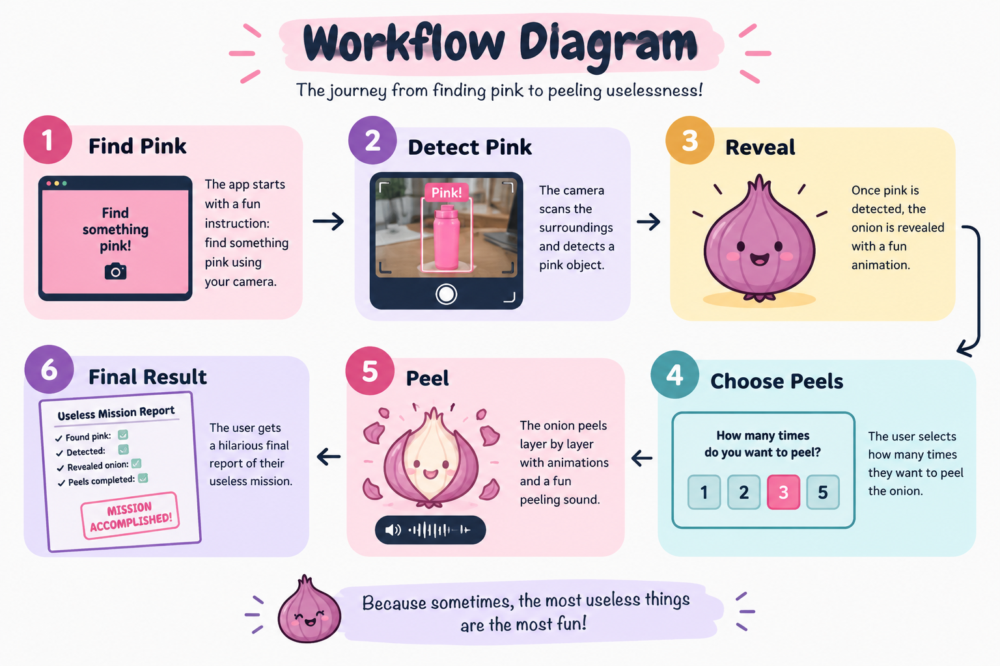

# [Hidden Layer] 🎯

## Basic Details
### Team Name: [BRAIN ROT]

### Team Members

- Member 1: [Sreenanda V H] - [TKM College OF Engineering]
- Member 2: [Vaishnavi S Kumar] - [TKM College OF Engineering]

### Project Description
[One innocent search for pink somehow turns into a mission of questionable importance.
Follow the instructions. Trust the process. Expect nothing]

### The Problem (that doesn't exist)
[People have forgotten the importance of finding random pink objects.
There was no system to turn this meaningless activity into an unnecessarily complicated mission. We decided to fix that.]

### The Solution (that nobody asked for)
[Our solution is simple: make the user find something pink, follow instructions, and spend their precious time completing a pointless mission.
Because apparently, that was necessary!]

## Technical Details
### Technologies/Components Used
For Software:
- [ HTML,CSS,JavaScript]
- [Frameworks used]
- [Libraries used]
- [Visual Studio Code, Git, GitHub, Live Server]

For Hardware:
- [List main components]
- [List specifications]
- [List tools required]

### Implementation
For Software:
# Installation
[No installation required]

# Run
[Open `index.html` in a web browser]

### Project Documentation
For Software:

# Screenshots (Add at least 3)

*Landing page*

*pink detection page*

*onion peeling page*

# Diagrams

*> **Workflow of the project, from finding something pink to completing the completely useless mission.**
*

For Hardware:

# Schematic & Circuit

*Add caption explaining connections*

*Add caption explaining the schematic*

# Build Photos

*List out all components shown*

*Explain the build steps*

*Explain the final build*

### Project Demo
# Video
[https://drive.google.com/file/d/1TvlmbJOJ8n_U010qcNbpO-OaKoIxz-hT/view?usp=sharing]
*For the README demo video, keep it short and fun:

> **A completely unnecessary journey from finding pink to discovering... absolutely nothing useful.**
*

# Additional Demos
[Add any extra demo materials/links]

## Team Contributions
- [Sreenanda V H]: [Java Script+Audio effect+ gitHub + Vercel deployment]
- [Vaishnavi S kumar]: [Frontend or UI+Animation+testing+documentation ]
- 

---
Made with ❤️ at TinkerHub Useless Projects 

